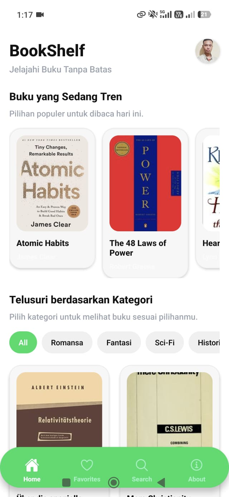
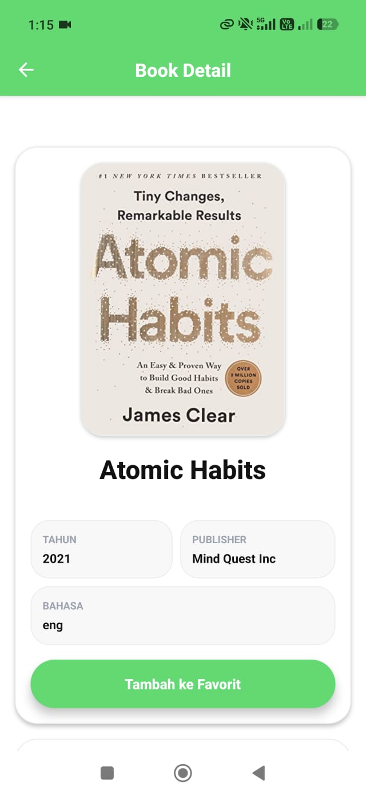
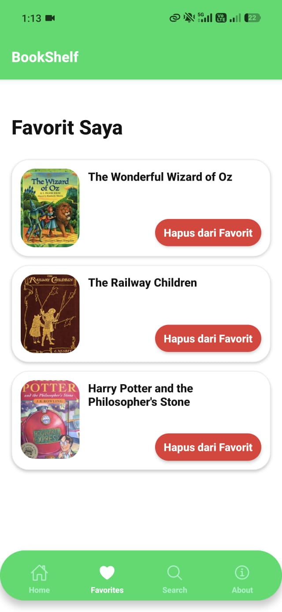
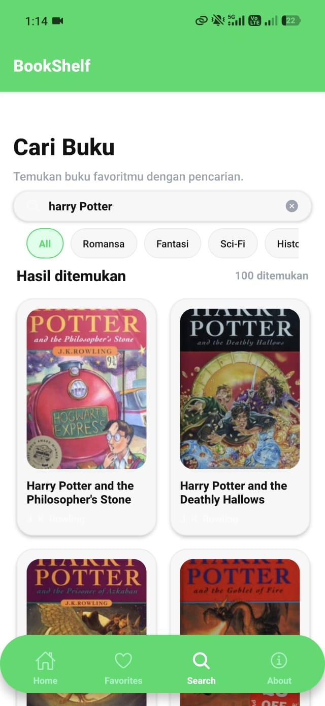
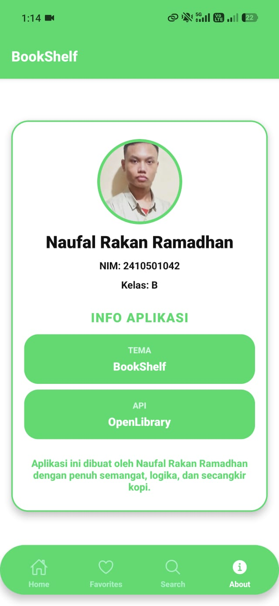

# BookShelf - Project UTS Mobile Lanjut

## Informasi Mahasiswa

- Nama : Naufal Rakan Ramadhan
- NIM : 2410501042
- Kelas : B

## Tema

Tema yang dipilih adalah Tema C (BookShelf)

## Tech stack yang digunakan

- **React Native**: 0.81.5
- **Expo**: ~54.0.34
- **React**: 19.1.0
- **State Management**: Zustand (^5.0.12)
- **Navigation**:
  - react-navigation/native (^7.2.2)
  - react-navigation/bottom-tabs (^7.15.9)
  - react-navigation/native-stack (^7.14.11)
- **HTTP Client**: Axios (^1.15.2)
- **Penyimpanan**: @react-native-async-storage/async-storage (2.2.0)
- **Komponen & Utilitas UI**:
  - expo-constants (~18.0.13)
  - expo-navigation-bar (~5.0.10)
  - expo-status-bar (~3.0.9)
  - react-native-safe-area-context (~5.6.0)
  - react-native-screens (~4.16.0)
- **Animasi & Gerakan**:
  - react-native-reanimated (~4.1.1)
  - react-native-gesture-handler (~2.28.0)
  - react-native-worklets (0.5.1)

## Cara Install & Menjalankan

1. Clone the repository:
   ```bash
   git clone https://github.com/Ampasan/uts-mobile-lanjut--2410501042-NaufalRakanRamadhan.git
   ```
2. Install dependencies:
   ```bash
   npm install
   ```
3. Start the development server:
   ```bash
   npx expo start
   ```

## Screenshot Aplikasi

### Home Screen

<p align="center">
  
</p>

### Detail Screen

<p align="center">
  
</p>

### Favorite Screen

<p align="center">
  
</p>

### Search Screen

<p align="center">
  
</p>

### About Screen

<p align="center">
  
</p>

## Link video demo

[Video Demo di Google Drive](https://drive.google.com/file/d/1A3bKTX5JSj80Bn76bMrOK981LLfauvUf/view?usp=sharing)

## Penjelasan & Justifikasi State management

Dalam proyek ini, saya menggunakan **Zustand** untuk mengelola state aplikasi. Alasan utamanya adalah kesederhanaan dan efisiensi performa. Dibandingkan **Redux**, Zustand jauh lebih praktis karena tidak membutuhkan banyak boilerplate (action, reducer, dispatcher) yang rumit. Untuk fitur seperti Daftar Favorit, Zustand sangat pas karena bisa langsung membuat *store* tanpa harus membungkus seluruh komponen dalam banyak Provider seperti pada **Context API**. Namun, Zustand juga memiliki kekurangan. Untuk aplikasi dengan state yang sangat kompleks dan membutuhkan middleware tingkat lanjut, Redux masih lebih unggul karena ekosistemnya yang lebih matang. Selain itu, Context API tetap menjadi pilihan bawaan React tanpa perlu dependensi tambahan.

## Daftar referensi

- [Open Library API](https://openlibrary.org/developers/api)
- [Video Tutorial React Native Floating Bottom Tabs](https://www.youtube.com/watch?v=xC6VawAfy2A&t=273s)
- [Dokumentasi Zustand](https://zustand.docs.pmnd.rs/learn/getting-started/introduction)
- [Dokumentasi Expo](https://expo.dev/)
- [Video Tutorial React Book Search App](https://www.youtube.com/watch?v=OhsaJFPNZts)
- [Dokumentasi React Native](https://reactnative.dev/)
- [Dokumentasi Babel](https://babeljs.io/docs/configuration)
- [Dokumentasi Npm](https://docs.npmjs.com/)
- [Dokumentasi Axios](https://axios.rest/)

# Refleksi Pengerjaan

Selama proses pengembangan aplikasi ini, saya mengalami beberapa kendala yang cukup menantang, terutama pada bagian filter kategori. Awalnya, saya mengira filter bisa langsung diterapkan dari data yang diambil, namun ternyata data dari API tidak sepenuhnya sesuai dengan struktur kategori yang saya rancang. Saya harus mengambil nilai subject terlebih dahulu, lalu melakukan penyesuaian manual agar bisa cocok dengan kategori yang sudah dibuat di aplikasi. Proses ini cukup memakan waktu karena perlu memastikan hasil filter tetap relevan dan konsisten.

Selain itu, terdapat kendala pada fitur pencarian. Implementasi awal menggunakan auto search, sehingga setiap perubahan input langsung memicu pencarian. Padahal, tujuan awal saya adalah pencarian hanya dilakukan saat pengguna menekan tombol enter. Hal ini sempat menyebabkan performa kurang optimal dan UX menjadi kurang nyaman.

Saya juga beberapa kali mengalami masalah ketika data gagal dimuat. Hal ini kemungkinan disebabkan oleh koneksi API atau penanganan state yang belum optimal. Dari sini saya belajar pentingnya error handling dan fallback UI agar aplikasi tetap memberikan feedback ke pengguna.

Di sisi UI, saya mencoba membuat navigasi bawah yang bersifat floating sekaligus menghilangkan navigasi bawaan perangkat. Implementasi ini cukup tricky karena harus menyesuaikan dengan layout dan memastikan tidak mengganggu interaksi utama.

Dari keseluruhan proses, saya belajar bahwa integrasi API, pengelolaan state, dan desain UX memiliki keterkaitan erat dan perlu dirancang dengan matang sejak awal.
